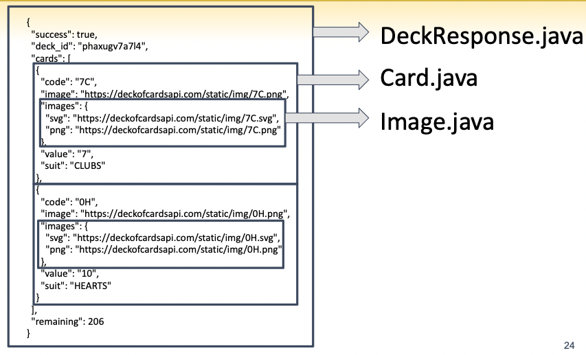

# Using an Object to Maintain State #

This lab will have you learn a new technology.  It will weave in object oriented programming as well.

The technology is JSON.  JSON is critically important.  
I have not worked on an Industry project the last 12 years that has not used JSON.  It's used in everything.  It is the way that data is transferred for most applications on the Internet.   You use it continually on your phone and likely do not realize it.

---

**Project**: Develop a Tutorial for New Hires on How to Use JSON

**Created By**: Joe Smith

**Date Created**: February 26, 2024

**Version**: 1.0

**Target Community of Interest**: ACME Corp's latest set of intern hires.

___

**Research Goal**: New hire interns become familiar with JSON.  They understand what it is and how to access elements in the data structure.

**Summary**: The objects returned by OpenAI are JSON objects.  You were given code to manipulate the replies in a specific way in prior labs.  In this lab we will do something different.  We will use it create Java objects from replies sent by a server.  It's a very typical scenario for communication over the Internet - objects sent as JSON messages by a server and then reconstituted as objects on the client.

**References** 

Here is a nice introduction from Oracle on what JSON is:

https://www.oracle.com/database/what-is-json/#:~:text=JSON%20has%20become%20popular%20as,since%20deserialization%20isn%27t%20required.

Here is a great site that aggregates may data feeds that return results as JSON.  It is fairly easy to understand the concept of JSON.  You should access these and look at the format of the JSON replies.

https://mixedanalytics.com/blog/list-actually-free-open-no-auth-needed-apis/

**Performance Parameters** Your code will take a JSON reply and translate it into a Java object that represents the data elements and data types of the JSON object.  This object will compile and be accessible.

**Research Approach Needs and Tasks:**

We start with a simple example.  Look in the folder usercode.  You will see two Java files.  

Main.java - It has a small JSON message.  Visually inspecting it shows it is talking about a Person.  The Person's  name is John and his age is 30.  The class then creates a class called ObjectMapper. This Mapper:

1. Takes the json, and

2. Takes the class definition of Person (also defined in the usercode directory), and

3. Creates a Person instance with the information for John.

You can see this is the case by simply reading the code and then running the main method of Main.java.  It uses a library named Jackson.  In Java, when you are using and manipulating JSON, Jackson is the most popular library to use.

So, what is happening here? In this example, we use the ObjectMapper class from the Jackson library to convert a JSON string into a Person object. The readValue method is used for deserialization, where the first argument is the JSON string, and the second argument is the target Java class into which the JSON should be mapped. Finally, we can access the properties of the Person object using getter methods.

Go ahead and change the variable in Person named age to some other name.  That is, change age to be something like person_age.  See if the code runs - it won't!  It is simply matching the key names of the JSON object class variable names and then assign that variable the JSON object value.

This is a rather simplistic view of how it works.  But - it's meant to be simplistic.  You can, of course, make this much more complex when reading in JSON messages.  But for now, let's make it easy.

**Task 1**

Get familiar with the deck of cards API.  It is found here - and sort of fun:

https://deckofcardsapi.com/

Let's review this together.  It gives you access to an API that provides access to a deck of cards.  You can then shuffle the cards, remove cards, etc.  The API's service maintains the state of the deck of cards.  Here is an example of a reply where the user of the API requested two cards be removed from a set of six decks (the typical amount used in BlackJack):

**Task 2** This Lab simply has you translate the JSON message above into three corresponding Java Objects. These are also identified in the image.  You will see that /usercode has in it:

- DeckResponse.java. and corresponding DeckResponseTest.java

- Card.java and corresponding CardTest.java

- Images.java and corresponding ImageTest.java

Review and understand these tests.

**Task 3** Implement the code:

1. Start with the Images.java class.  Look at the corresponding ImageTest.java.   Reference the diagram above and understand what an Image stores as its state - the two graphics for the card.  Simply implement the missing methods and class variables in Image.java and get that test to pass.

2. Repeat for Card.java

3. Repeat for DeckResponse.java.  There is one subtly about this class that is solved for you.  How to reference names in JSON files that have underscores.

Once you get these tests to pass, run the submission.  It runs the exact same set of tests so you should be able to submit!