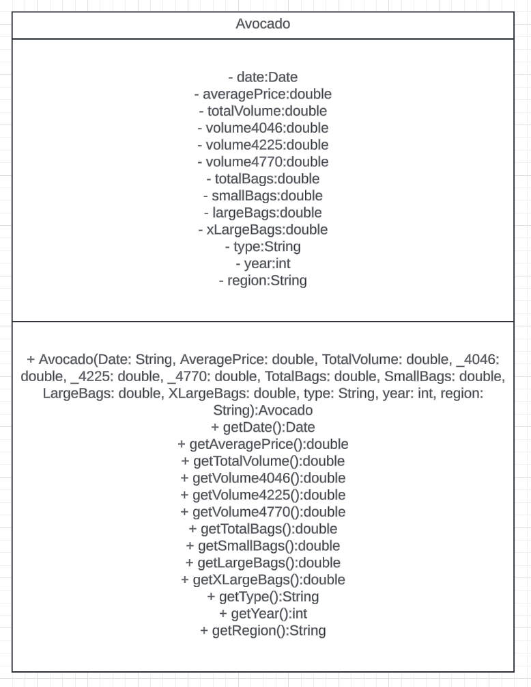

# Avocado Prices as Java Objects #

Last week we translated a JSON response into some Java objects.  This week we will take a CSV file and do the exact same 
thing.  Here each line represents a potential Java object.  The headers represent the attributes of the Java object.  
This time, our focus will be avocado prices.  Yes, avocado prices. 

---

**Project**: Develop a Tutorial for New Interns that Demonstrates How to Translate a CSV Representation of an Object into Code.

**Created By**: Joe Smith

**Date Created**: March 18, 2024

**Version**: 1.0

**Target Community of Interest**: ACME Corp's latest set of intern hires.

___

**Research Goal**: Intern Hires Learn how to Access and Persist Object State to Disk.

**Summary**: New hire interns are familiar with JSON and how these represent JSON object.  ACME has a code base where
Java objects are written to and read from CSVs. The principle is similar to accessing a JSON object.  It will
reinforce how objects can maintain state and be persisted.

**References**

Refer to this link here from Kaggle.com.  Kaggle holds a trove of data set that are publicly available.  
You should look around, there are many data sets that might be interesting to you.  We will review this data set specifically.

https://www.kaggle.com/datasets/neuromusic/avocado-prices/data

What a neat data set.  The prices of avocados and sales regionally across the U.S.  
The data set has been uploaded to the /userdata folder of this lab as the CSV file.  CSV stands for comma separated values.
Download the file and review its contents.  You will see avocado prices represented as a time 
series across different regions of the U.S.  You can see the prices fluctuate over time.

**Performance Parameters** Your code will take a CSV file and translate it into a Java object that represents the data elements and data types of the JSON object.  This object will compile and be accessible.

**Research Approach Needs and Tasks:**

**Task 1**:  Create the Avocado.java Class

You will turn the CSV file into Avocado.java objects and store them in an ArrayList.  Here is the UML diagram for the Avocado class you will create.  Do not be intimidated - it looks like a lot but it simply matches the columns of the CSV file.  The constructor is pretty big:

Be sure to implement all the getters in this class!  One has been implemented for you as an example.  Note - it returns 0.0 and that will need to be changed.

**Task 2** Implement AvocadoDriver.java Class:

AvocadoDriver.java performs the following:

1. It reads the CSV file in.

2. It iterates through the CSV a row at a time.

3. It splits each row based on a comma (,) - placing the line into a String[] array.

4. At that point, you have it split into the arguments you need for the constructor.  With a few warnings.  First, you need to consider the header row - you do not want to construct an Avocado object for that!  The 'header row' is the one that contains the column names.  Second, the first column of the CSV is not use in construction of an Avocado object.  You need to be aware of that.

**Task 3** Submit and Run Tests

If you do the above - you can submit and run the tests.  You need to get them to pass!

